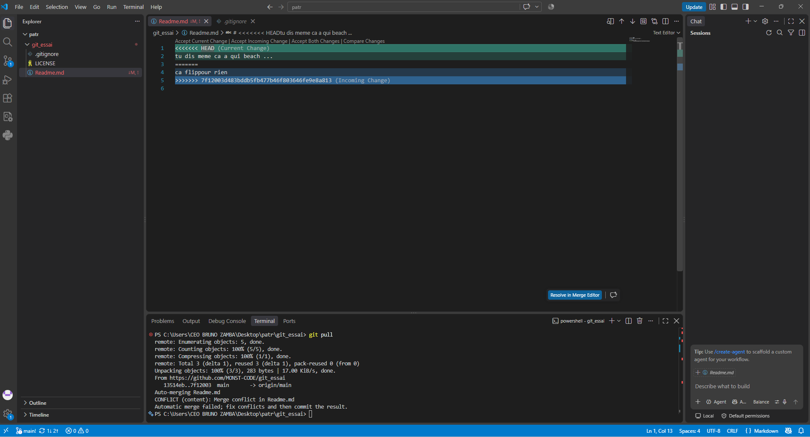
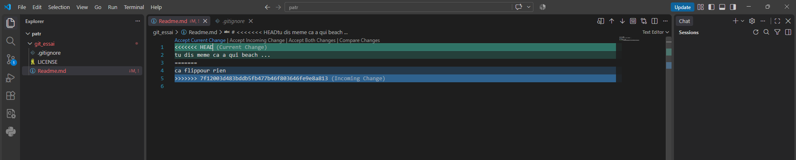

# Demo 2 : Les Conflits en Direct
## 1-Conflit lors de la Creation du repo sur git et sur notre environnement
Pour creer un conflit je suis passer par une autre methode je suis aller sur mon bureau jai creer le dossier **git_essai** et je l'ai laiser vide pour un debut puis je suis aller sur github creer un repo avec le meme Nom  **git essai**  lors de la creation jai choisis la licence MIT et comme language C++ ce qui fit que mon depot etant creer surinternet possedait donc deja des fichier je suis revenu sur mon pc et j'ai creer un fichier **Readme.md** ensuite pas de commande **git pull** directement du **git remote add origin https://github.com/MONST-CODE/git_essai** voici donc le conflits creer .

```
PS C:\....\...\...\git_essai> git init
Initialized empty Git repository in C:/Users/CEO BRUNO ZAMBA/Desktop/git_essai/.git/
PS C:\....\...\...\git_essai> git remote add origin https://github.com/MONST-CODE/git_essai
PS C:\....\...\...\git_essai> git add .
>> git commit -m "Premier commit"
>> git push -u origin main
>> 
On branch main

Initial commit

nothing to commit (create/copy files and use "git add" to track)
error: src refspec main does not match any
error: failed to push some refs to 'https://github.com/MONST-CODE/git_essai'
PS C:\...\....\...\git_essai> git add .
>> git commit -m "Premier commit"
>> git push -u origin main
>> 
[main (root-commit) 0403a3d] Premier commit
 1 file changed, 1 insertion(+)
 create mode 100644 Readme.md
To https://github.com/MONST-CODE/git_essai
 ! [rejected]        main -> main (fetch first)
error: failed to push some refs to 'https://github.com/MONST-CODE/git_essai'
hint: Updates were rejected because the remote contains work that you do not
hint: have locally. This is usually caused by another repository pushing to
hint: the same ref. If you want to integrate the remote changes, use
hint: 'git pull' before pushing again.
hint: See the 'Note about fast-forwards' in 'git push --help' for details.
PS C:\Users\CEO BRUNO ZAMBA\Desktop\git_essai> git pull
remote: Enumerating objects: 4, done.
remote: Counting objects: 100% (4/4), done.
remote: Compressing objects: 100% (4/4), done.
remote: Total 4 (delta 0), reused 0 (delta 0), pack-reused 0 (from 0)
Unpacking objects: 100% (4/4), 1.81 KiB | 39.00 KiB/s, done.
From https://github.com/MONST-CODE/git_essai
 * [new branch]      main       -> origin/main
There is no tracking information for the current branch.
Please specify which branch you want to merge with.
See git-pull(1) for details.

    git pull <remote> <branch>

If you wish to set tracking information for this branch you can do so with:

    git branch --set-upstream-to=origin/<branch> main


**PS C:\...\...\...\git_essai> git add .                         
PS C:\...\...\....\git_essai> git commit -m "premier commit"    
On branch main            
nothing to commit, working tree clean
PS C:\....\...\...\git_essai> git push                      
fatal: The current branch main has no upstream branch.
To push the current branch and set the remote as upstream, use

    git push --set-upstream origin main

To have this happen automatically for branches without a tracking
upstream, see 'push.autoSetupRemote' in 'git help config'.

PS C:\....\....\....\git_essai> git push --set-upstream origin main
To https://github.com/MONST-CODE/git_essai
 ! [rejected]        main -> main (non-fast-forward)
error: failed to push some refs to 'https://github.com/MONST-CODE/git_essai'
hint: Updates were rejected because the tip of your current branch is behind
hint: its remote counterpart. If you want to integrate the remote changes,
hint: use 'git pull' before pushing again.
hint: See the 'Note about fast-forwards' in 'git push --help' for details.
PS C:\....\....\....\git_essai> git pull
There is no tracking information for the current branch.
Please specify which branch you want to merge with.
See git-pull(1) for details.

    git pull <remote> <branch>

If you wish to set tracking information for this branch you can do so with:

    git branch --set-upstream-to=origin/<branch> main

PS C:\....\....\..\git_essai> git add .                         
PS C:\...\...\...\git_essai> git commit -m "premier commit"    
On branch main
nothing to commit, working tree clean
PS C:\...\....\...\git_essai> git push --set-upstream origin main
To https://github.com/MONST-CODE/git_essai
 ! [rejected]        main -> main (non-fast-forward)
error: failed to push some refs to 'https://github.com/MONST-CODE/git_essai'
hint: Updates were rejected because the tip of your current branch is behind
hint: its remote counterpart. If you want to integrate the remote changes,
hint: use 'git pull' before pushing again.
hint: See the 'Note about fast-forwards' in 'git push --help' for details.
```
## RESOLUTION
```bash
PS C:\...\...\...\git_essai> **git pull origin main --allow-unrelated-histories**
>> 
From https://github.com/MONST-CODE/git_essai
 * branch            main       -> FETCH_HEAD
Merge made by the 'ort' strategy.
 .gitignore | 69 ++++++++++++++++++++++++++++++++++++++++++++++++++++++++++++++
 LICENSE    | 21 +++++++++++++++++++
 2 files changed, 90 insertions(+)
 create mode 100644 .gitignore
 create mode 100644 LICENSE
PS C:\.....\...\...\git_essai> git push -u origin main
>> 
Enumerating objects: 6, done.
Counting objects: 100% (6/6), done.
Delta compression using up to 16 threads
Compressing objects: 100% (3/3), done.
Writing objects: 100% (5/5), 571 bytes | 114.00 KiB/s, done.
Total 5 (delta 0), reused 0 (delta 0), pack-reused 0 (from 0)
To https://github.com/MONST-CODE/git_essai
   66cc75b..13514eb  main -> main
branch 'main' set up to track 'origin/main'.
PS C:\...\...\..\git_essai> \
```
## HISTORIQUE
```bash
#command git donnant les informations de maniere exhaustive
git log -p
>> 
#Debut des Infos
commit 13514eb3fb43e2d88c0793b64d8d466f2e5f01a7 (HEAD -> main, origin/main, origin/HEAD)
Merge: 0403a3d 66cc75b
Author: MONST-CODE <edinzambabruno@gmail.com>
Date:   Fri Sep 18 04:09:48 2026 +0100

    Merge branch 'main' of https://github.com/MONST-CODE/git_essai
    Premier commit

commit 0403a3d5b7db1f31feebbce465b5aa802e4178f4
Author: MONST-CODE <edinzambabruno@gmail.com>
Date:   Thu Sep 17 20:07:36 2026 +0100

    Premier commit

diff --git a/Readme.md b/Readme.md
new file mode 100644
index 0000000..8b13789
--- /dev/null
+++ b/Readme.md
@@ -0,0 +1 @@
+

commit 66cc75b5f9c449b13df747ffcd986601948734ac
Author: MONST-CODE <edinzambabruno@gmail.com>
Date:   Thu Sep 17 19:53:36 2026 +0100

    Initial commit

diff --git a/.gitignore b/.gitignore
new file mode 100644
index 0000000..0ba1c63
--- /dev/null
+++ b/.gitignore
@@ -0,0 +1,69 @@
#fin des infos  moyenne comprehensible concernant les commit 
+# Prerequisites
+*.d
+
+# Compiled Object files
+*.slo
+*.lo
+*.o
+*.obj
+
+# Precompiled Headers
+*.gch
+*.pch
+
+# Linker files
+*.ilk
+
+# Debugger Files
+*.pdb
+
+# Compiled Dynamic libraries
+*.so
+*.dylib
+*.dll
+*.so.*
+
+
+# Fortran module files
+*.mod
+*.smod
+
+# Compiled Static libraries
+*.lai
+*.la
+*.a
+*.lib
+
+# Executables
+*.exe
+*.out
+*.app
+
+# Build directories
+build/
+Build/
+build-*/
+
+# CMake generated files
+CMakeFiles/
+CMakeCache.txt
+cmake_install.cmake
+Makefile
+install_manifest.txt
+compile_commands.json
+
+# Temporary files
+*.tmp
+*.log
+*.bak
+*.swp
+
+# vcpkg
+vcpkg_installed/
+
+# debug information files
+*.dwo
+
+# test output & cache
+Testing/
+.cache/
diff --git a/LICENSE b/LICENSE
new file mode 100644
index 0000000..ae14514
--- /dev/null
+++ b/LICENSE
@@ -0,0 +1,21 @@
+MIT License
+
+Copyright (c) 2026 MONST-CODE
+
+Permission is hereby granted, free of charge, to any person obtaining a copy
+of this software and associated documentation files (the "Software"), to deal
+in the Software without restriction, including without limitation the rights
+to use, copy, modify, merge, publish, distribute, sublicense, and/or sell
+copies of the Software, and to permit persons to whom the Software is
+furnished to do so, subject to the following conditions:
+
+The above copyright notice and this permission notice shall be included in all
+copies or substantial portions of the Software.
+
+THE SOFTWARE IS PROVIDED "AS IS", WITHOUT WARRANTY OF ANY KIND, EXPRESS OR
+IMPLIED, INCLUDING BUT NOT LIMITED TO THE WARRANTIES OF MERCHANTABILITY,
+FITNESS FOR A PARTICULAR PURPOSE AND NONINFRINGEMENT. IN NO EVENT SHALL THE
+AUTHORS OR COPYRIGHT HOLDERS BE LIABLE FOR ANY CLAIM, DAMAGES OR OTHER
+LIABILITY, WHETHER IN AN ACTION OF CONTRACT, TORT OR OTHERWISE, ARISING FROM,
+OUT OF OR IN CONNECTION WITH THE SOFTWARE OR THE USE OR OTHER DEALINGS IN THE
+SOFTWARE.
```
## 2-Conflit de ligne demander danjs l'EXO
* Clonner le depot dans un autre dossier 
```
PS C:\''''\'''\Desktop\patr> git clone https://github.com/MONST-CODE/git_essai                      
Cloning into 'git_essai'...
remote: Enumerating objects: 9, done.
remote: Counting objects: 100% (9/9), done.
remote: Compressing objects: 100% (7/7), done.
remote: Total 9 (delta 1), reused 5 (delta 0), pack-reused 0 (from 0)
Receiving objects: 100% (9/9), done.
Resolving deltas: 100% (1/1), done.
```
* ecrire dans notre **Readme(le Premier celui qui est au bureau)**  et le pusher sur github
```bash
#//contenue du Readme
ca flippour rien
#//Terminal
PS C:\'''\''''\Desktop\git_essai> git add Readme.md                                                 
PS C:\\'''\Desktop\git_essai> git commit -m "fichier Readme modifier dans le premier repertoire"
[main 7f12003] fichier Readme modifier dans le premier repertoire
 1 file changed, 1 insertion(+), 1 deletion(-)
PS C:\'''''\'''\Desktop\git_essai> git push                                                          
Enumerating objects: 5, done.
Counting objects: 100% (5/5), done.
Delta compression using up to 16 threads
Compressing objects: 100% (2/2), done.
Writing objects: 100% (3/3), 303 bytes | 101.00 KiB/s, done.
Total 3 (delta 1), reused 0 (delta 0), pack-reused 0 (from 0)
remote: Resolving deltas: 100% (1/1), completed with 1 local object.
To https://github.com/MONST-CODE/git_essai
   13514eb..7f12003  main -> main
PS C:\''\'''\Desktop\git_essai> 
```
* ecrire Dans notre Readme 2
```bash
#//Contenue du Readme 
tu dis meme ca a qui beach
#//contenue du Terminal

PS C:\''\''''\Desktop\patr\git_essai> git add Readme.md                                                 
PS C:\'''\'''\Desktop\patr\git_essai> git commit -m "fichier Readme modifier dans le premier repertoire le deuxieme"
[main ac31d4b] fichier Readme modifier dans le premier repertoire le deuxieme
 1 file changed, 1 insertion(+)
PS C:\Users\CEO BRUNO ZAMBA\Desktop\patr\git_essai> git push                                                                      
To https://github.com/MONST-CODE/git_essai.git
 ! [rejected]        main -> main (fetch first)
error: failed to push some refs to 'https://github.com/MONST-CODE/git_essai.git'
hint: Updates were rejected because the remote contains work that you do not
hint: have locally. This is usually caused by another repository pushing to
hint: the same ref. If you want to integrate the remote changes, use
hint: 'git pull' before pushing again.
hint: See the 'Note about fast-forwards' in 'git push --help' for details.
```
## Resolution du fast-forwards
* taper git pull (dans le dépôt défectueux)

vous obtiendrez ce resultat 




vous choisisez et le soucis est resolu  vous pouvez choisir ce qui es a conserver ou pas .


